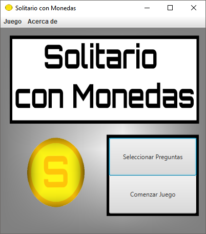
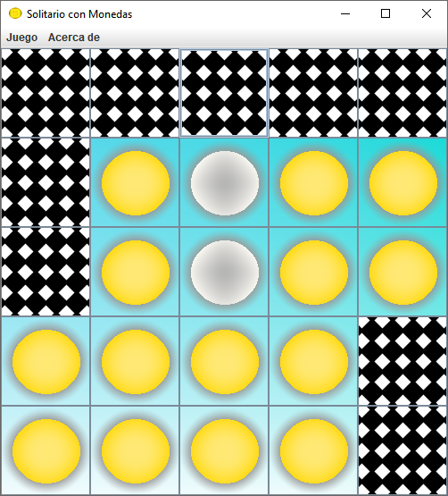
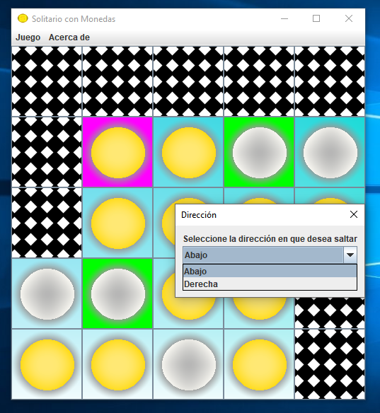
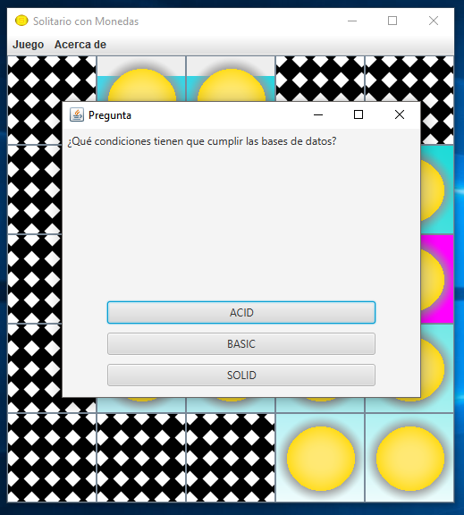
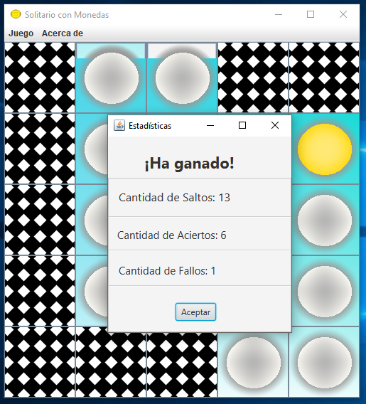
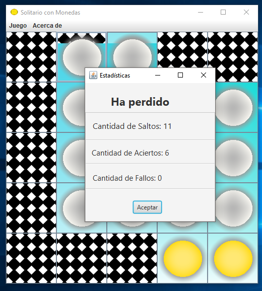

# Solitario con Monedas

## Descripción del Juego

El **Solitario con Monedas** es un juego para un sólo jugador en el cual el objetivo es eliminar las monedas que se encuentran sobre el tablero hasta quedar con sólo una de ellas.

El juego tiene una modalidad que incluye preguntas de carácter educativo.

## ¿Cómo jugar al Solitario con Monedas?

### Menu Inicial

Al ejecutar el juego se abre el siguiente menu:

Las opciones disponibles son :

- **Seleccionar preguntas :** permite seleccionar que conjunto de preguntas utilizar al jugar
- **Comenzar juego :** muestra el tablero inicial para empezar a jugar al Solitario con Monedas

#### Seleccionar preguntas

Al hacer click en el botón **Seleccionar preguntas** se despliega la siguiente ventana que permite seleccionar con con conjunto de preguntas jugar.

Hacer click en la categoría elegida y hacer click en el boton **Iniciar Juego**.

Una vez seleccionada la categoría de preguntas, se vuelve al menú inicial.

#### Comenzar juego

Para empezar a jugar al Solitario con Monedas hacer click en el boton

### Tablero de Juego

Para cumplir el objetivo de eliminar las monedas del tablero, se debe seleccionar una moneda que pueda saltar por encima de otra y caer en una casilla vacía, nunca sobre una casilla nula.

El salto puede ser en 4 direcciones: arriba,abajo,izquierda o derecha.

Si sólo existe un salto posible para la moneda seleccionada, el sistema lo realiza automaticamente sin necesidad de que el jugador deba elegir la casilla de destino.

La moneda que es saltada es automáticamente eliminada del tablero.

#### Más de una casilla de destino

Si existe más de un salto posible (que aparecen coloreadas en verde) para la moneda seleccionada, el sistema despliega un cuadro para seleccionar la direccion deseada.

Seleccionar direccion y hacer click en el botón **Aceptar**.

### Preguntas

Cada dos movimientos , el juego lanza una pregunta para evaluar los conocimientos del jugador.

Para responder al desafio, hacer click en la opcion seleccionada.

### Fin del Juego

Cuando no hay más movimientos posibles, la partida se da por finalizada.

El jugador gana cuando consigue dejar sólo una moneda en el tablero.

En caso contrario pierde la partida.

#### Estadísticas

Al finalizar un juego el sistema muestra una ventana con las estadísticas de la partida considerando:

- **Cantidad de Saltos:** número de movimmientos realizados
- **Cantidad de Aciertos:** número de preguntas respondidas correctamente
- **Cantidad de Fallos:** número de preguntas respondidas de forma incorrecta

